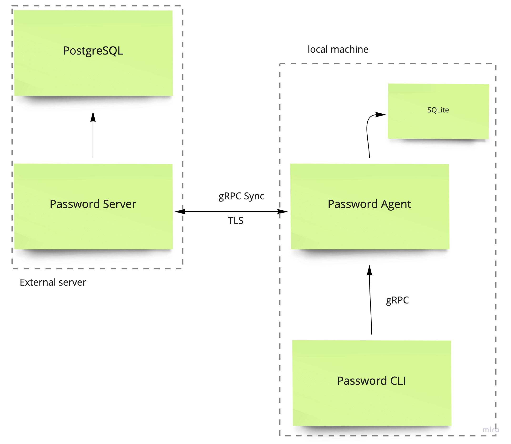
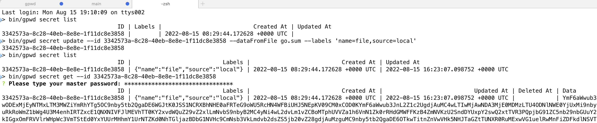

# Golang Password Manager

## Высокоуровневая архитектура



Инфраструктура менеджера секретов состоит из:
* CLI для создания и управления секретами
* фонового агента, отвечающего за управление локальным кэшем в SQLite3 и синхронизацией с сервером
* Сервера, представляющего собой "облачное"-хранилище и позволяющего работать с данными секретов с нескольких устройств 

## Низкоуровневая архитектура


### Взаимодействие компонентов
Взаимодействие всех компонентов происходит по gRPC с TLS аутентификацией. Авторизация пользователя выполняется на сервере с помощью логина и пароля с выдачей временных JWT-токенов для выполнения синхронизации.

### Секреты
Секреты шифруются симметричным шифрованием с помощью мастер-пароля, указываемым при запуске агента. В дальнейшем, чтобы прочитать секрет, пользователь CLI должен указать мастер-пароль для расшифровки. Операции создания, обновления и удаления секретов не требуют мастер-пароля.

Запуск агента запрашивает ввод мастер-пароля:

```shell
bin/gpwd agent --logLevel DEBUG
? Please type your master password: *************
```

Минимальная длина мастер-пароля - 32 символа.

Для запуска агента с помощью сервис-менеджера (`systemd`), мастер пароль можно передать в переменной окружения `MASTER_PASSWORD`:

```shell
export MASTER_PASSWORD=.....my_password....
bin/gpwd agent --logLevel DEBUG &
```

### Подключение к "облачному"-хранилищу 
Пользователь CLI выполняет аутентификацию на сервере с помощью команды `account`:

```shell
gpwd account create --username igortiunov --serverAddress localhost:8080
```

Агент выполняет регистрацию аккаунта на указанном сервере, сохраняет данные аутентификации в локальном кэше и, в дальнейшем, выполняет периодическую синхронизацию с сервером. Частота синхронизации задаётся при запуске агента с помощью параметра `syncInterval`.

За управление секретами отвечает соответствующий набор CRUDL команд (`create`, `update`, `delete`, `list`, `get`):

